# CoARA Action Planner

[](https://doi.org/10.5281/zenodo.21492548)

**Self-assess your institution against the ten CoARA commitments and get a prioritised,
editable reform action plan — entirely in your browser.**

A static React app. Answer 24 diagnostic questions, and it scores your institution's maturity
across the ten commitments of the
[CoARA Agreement on Reforming Research Assessment](https://coara.org/), then generates a
prioritised action list and a corpus-grounded, editable action-plan narrative you can export.
Nothing is uploaded; everything runs client-side and persists only in your browser's
`localStorage`.

Built for the people who actually have to write the plan — research offices, institutional
leadership, reform working groups, and anyone drafting a CoARA action plan for submission.

🔗 **Live:** https://rijdho.github.io/coara-action-planner/

Available in **English, Spanish, French and German** (auto-detected, switchable).


This is the **open twin** of the hosted
[Reform Assessment toolkit](https://metaudits.rijdho.org/reform-assessment/). That family keeps
its calibrated methodology server-side; this repository moves the *same* questions, actions and
prioritisation algorithm into the browser, in readable form, so the assessment logic can be
inspected, cited, and adapted. Inspired by the open, community-first philosophy of
[Metadata Game Changers](https://metadatagamechangers.com/).

## What it does

Five steps: **Start → Questionnaire → Plan → Results → Report.**

```mermaid
flowchart LR
    accTitle: The five steps of an assessment
    accDescr: Start names the institution and sets up one perspective per respondent role. Each perspective answers the same 24-question questionnaire, and the tool consolidates the answers into one profile while surfacing where the readings diverge. Plan applies optional tuning, Results scores maturity and ranks actions, and Report drafts an editable action-plan narrative.

    start["🏛️ Start<br/>institution, perspectives"]
    questionnaire["📋 Questionnaire<br/>24 questions, 0–5 maturity"]
    consolidated["🔀 Consolidated profile<br/>divergence surfaced"]
    plan["🎚️ Plan<br/>horizon, context, targets"]
    results["📊 Results<br/>radar, gaps, ranked actions"]
    report["📝 Report<br/>editable narrative"]

    start --> questionnaire
    questionnaire -->|"once per respondent role"| consolidated
    consolidated --> plan --> results --> report

    classDef input fill:#dbeafe,stroke:#2563eb,stroke-width:2px,color:#1e3a5f
    classDef derived fill:#fef9c3,stroke:#ca8a04,stroke-width:2px,color:#713f12
    classDef output fill:#dcfce7,stroke:#16a34a,stroke-width:2px,color:#14532d

    class start,questionnaire,plan input
    class consolidated derived
    class results,report output
```



- **Start** — name the institution and set up *perspectives*: answer the questionnaire once per
  respondent role (e.g. research office, leadership, a working group), and the tool consolidates
  them and surfaces where their readings diverge.
- **Questionnaire** — 24 diagnostic questions mapped to the ten commitments, scored on a 0–5
  maturity model (Unaware → Aware → Exploring → Planning → Implementing → Embedded).
- **Plan** — optional tuning: time horizon, institutional context, priority commitments, whether
  to include high-effort actions, and per-commitment *target* levels (your ambition).
- **Results** — a maturity radar, a per-commitment breakdown, and a prioritised action list (each
  action ranked by the size of its gap × expected impact, adjusted for effort, context and
  ambition). Export the profile as PNG, or the full input state as a reproducible JSON config.
- **Report** — a pre-structured, **editable** CoARA action-plan narrative drafted from your
  answers, with the responsible unit / timeframe / indicator fields left as blanks to fill in.
  Copy, download (`.md`/`.txt`), or print.


## The methodology is the point

The calibration lives in [`src/data/`](src/data/), in plain readable JavaScript:

| File | What it holds |
|---|---|
| [`questions.js`](src/data/questions.js) | 24 diagnostic questions, each with 0–5 answer options mapped to a commitment |
| [`commitments.js`](src/data/commitments.js) | the ten CoARA commitments + the 6-level maturity model |
| [`actions.js`](src/data/actions.js) | 45 recommended actions (each with `fromLevel`/`toLevel`/`effort`/`impact`, a `theme` key, real institutional examples, and a `planText` — the action restated as institutional first-person prose for the generated plan) **and** the `prioritiseActions` algorithm |
| [`evidence.js`](src/data/evidence.js) | per-theme prevalence across the 314-plan corpus (`THEME_FREQUENCY` + the `universal / common / emerging / frontier` bands shown as "N% of 314 plans" on Results) |
| [`context.js`](src/data/context.js) | 6 institutional contexts that re-weight priorities |
| [`perspectives.js`](src/data/perspectives.js) | the 10 respondent roles and their `ROLE_WEIGHTS` — how divergent readings are consolidated |
| [`i18n/{es,fr,de}.js`](src/data/i18n/) | full Spanish / French / German overlays of the above |

The questions and actions were hand-calibrated by reading 15 real institutional action plans
(UCM, Helmholtz, DCU, UCLouvain, AQU Catalunya, FRQ, LBG, SocRSE, Eurodoc, YUFE/UNIRI, UB, UPC,
OGS, SDU, U. Pannonia) and cross-checked against a corpus of 314 CoARA action plans from Zenodo.
It is offered as a starting point to inspect and adapt, not as an authoritative scoring — see
*Caveats*.

## Run locally

```bash
npm install
npm run dev        # http://localhost:5173
```

Build the static site:

```bash
npm run build      # → dist/
npm run preview    # serve the build locally
```

No backend, no API keys, no tracking.

## Tests

The calibration and the prioritisation algorithm are covered by unit tests (Node's built-in
runner, no dependencies beyond what the app already needs):

```bash
npm test          # or: node --test tests/*.test.mjs
```

`prioritise.test.mjs` asserts on **exact priority scores**, and those cases double as the
parity contract with the server-side engine behind the hosted sibling: the same answers must
produce the same ranking on both. A change that moves a number here should be mirrored there
or documented as a deliberate divergence. The algorithm cases use synthetic actions on
purpose, so recalibrating the real catalog cannot break tests that are about the maths.

`calibration.test.mjs` guards the failures that are silent rather than loud — a mistyped
`theme` still renders, it just quietly loses its "N% of 314 plans" evidence band; an action
whose `fromLevel` is not below its `toLevel` can never be recommended at all; a commitment
with no entry-level action tells an institution it is weakest there and then offers nothing
to do about it.

`i18n.test.mjs` pins the most fragile contract in the repository: the Spanish, French and
German action overlays align with `ACTIONS` **by array index**. Inserting an action mid-list
without inserting one at the same position in all three overlays shifts every later
translation onto the wrong action — nothing throws, the app just shows the wrong text in
three languages.

## Deploy

Any static host works (the build is self-contained with relative asset paths). This repo ships a
GitHub Actions workflow
([`.github/workflows/deploy.yml`](.github/workflows/deploy.yml)) that builds and publishes to
GitHub Pages on every push to `main`. Enable it once under
**Settings → Pages → Source: GitHub Actions**.

## Caveats

- **Directional, not authoritative.** The maturity scores and action rankings are a structured
  prompt for institutional reflection, not a certification. Two institutions at the same "level"
  can be in very different places.
- **The radar is a shape, not a score.** With ten axes in a fixed order, the polygon's area and
  outline carry no meaning — read the per-commitment numbers, not the picture.
- **Keyword-derived corpus evidence.** The "N% of 314 plans" figures on Results come from keyword
  matching over the full text of the published action plans — read them as directional bands
  (near-universal / common / emerging / frontier), not exact counts. Low prevalence is not a
  reason to skip an action: frontier practices are an opportunity to lead.
- **Your data stays local.** Because everything is in `localStorage`, clearing your browser data
  erases your assessment. Use the **Export config** button to save a reproducible copy.

## License

- **Code** — [MIT](LICENSE).
- **Calibration data** (`src/data/`) — [CC BY 4.0](https://creativecommons.org/licenses/by/4.0/).
  Reuse and adapt with attribution.

## Citation

If you use this tool or its calibration, please cite it — see [`CITATION.cff`](CITATION.cff) or
the "Cite this repository" button. Archived on Zenodo: concept DOI
[10.5281/zenodo.21492548](https://doi.org/10.5281/zenodo.21492548) (always resolves to the
latest version).
